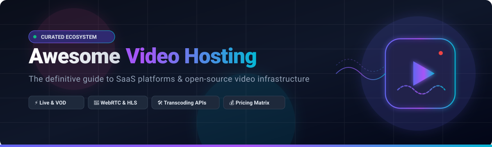

<div align="center">
  

  <br/><br/>

  <a href="https://github.com/ishandutta2007/Awesome-Awesome-Awesome"></a><a href="https://discord.gg/jc4xtF58Ve"></a>
  <a href="https://github.com/ishandutta2007/Awesome-Video-Hosting/stargazers"></a>
  <a href="https://github.com/ishandutta2007/Awesome-Video-Hosting/network/members"></a>
  <a href="https://github.com/ishandutta2007/Awesome-Video-Hosting/issues"></a>
  <a href="https://github.com/ishandutta2007/Awesome-Video-Hosting/pulls"></a>
  <a href="https://creativecommons.org/publicdomain/zero/1.0/"></a>
  <a href="https://github.com/ishandutta2007"></a>

  <p align="center">
    <strong>The Definitive Directory of Video Hosting Platforms, Streaming Servers, WebRTC Infrastructure, Video Transcoding Engines, HTML5 Players, and OTT Solutions.</strong>
  </p>
</div>

---

## 📖 Overview

A comprehensive, curated collection of **SaaS/Hosted Platforms** and **Open-Source GitHub Projects** tailored for **Video Hosting, Live Streaming, Video On Demand (VOD), OTT, Adaptive Bitrate Streaming (HLS / DASH), WebRTC Low-Latency Delivery, and Video APIs**.

Whether you are architecting a multi-tenant video portal, building interactive livestreaming apps, launching a subscription OTT network, or deploying self-hosted media servers, this repository serves as your ultimate architectural reference and vendor evaluation guide.

---

## 📑 Table of Contents

- [☁️ SaaS & Hosted Video Platforms](#️-saas--hosted-video-platforms)
- [🌟 Top Open-Source GitHub Projects](#-top-open-source-github-projects)
  - [📺 Video Hosting & CMS Platforms](#-video-hosting--cms-platforms)
  - [🛰️ Media Servers & Streaming Engines](#️-media-servers--streaming-engines)
  - [📡 Live Streaming & Broadcasting Infrastructure](#-live-streaming--broadcasting-infrastructure)
  - [⚙️ Video Transcoding, Codecs & Processing Engines](#️-video-transcoding-codecs--processing-engines)
  - [▶️ HTML5 Video Players & Web SDKs](#️-html5-video-players--web-sdks)
  - [⚡ WebRTC & Real-Time Low-Latency Media](#-webrtc--real-time-low-latency-media)
  - [🎬 OTT, Media Centers & Home Theater Streaming](#-ott-media-centers--home-theater-streaming)
  - [🗄️ Storage & Video Delivery CDN Infrastructure](#️-storage--video-delivery-cdn-infrastructure)
  - [📊 Video Analytics & Observability](#-video-analytics--observability)
- [🏗️ Open-Source Video Hosting Architecture Stack](#️-open-source-video-hosting-architecture-stack)
- [🧩 Video Hosting Core Building Blocks](#-video-hosting-core-building-blocks)
- [💡 Important Video Streaming Concepts](#-important-video-streaming-concepts)
- [⭐ Star History](#-star-history)
- [🤝 How to Contribute](#-how-to-contribute)
- [📜 License](#-license)

---

## ☁️ SaaS & Hosted Video Platforms

The following SaaS video hosting platforms are ranked in **descending order by company scale** (Market Cap / Enterprise Valuation / Annual Revenue).

| Platform | Company Scale / Valuation / Revenue | Description | Pricing (Starting Tier) | Free Tier / Free Trial Limits |
| :--- | :--- | :--- | :--- | :--- |
| **[Azure Media Services (Legacy / Ecosystem)](https://azure.microsoft.com/)** | ~$3.1 Trillion (Market Cap) / $240B+ Revenue | Cloud video workflow services (migrated to partner ecosystems like MediaKind & Bitmovin). | Partner offerings start from $0.01/GB bandwidth & $0.015/min encoding | 30-day Azure Free Trial with $200 credits for deploying media partner infrastructure. |
| **[Google Cloud Media CDN](https://cloud.google.com/media-cdn)** | ~$2.2 Trillion (Market Cap) / $350B+ Revenue | Planetary-scale media and video caching infrastructure built on Google's YouTube network backbone. | Starts at $0.04/GB egress (North America/Europe) + $0.0075 per 10,000 HTTP/HTTPS requests | 90-day Google Cloud trial with $300 in credits applicable across all Media CDN workloads. |
| **[Amazon IVS](https://aws.amazon.com/ivs/)** | ~$2.0 Trillion (Market Cap) / $100B+ AWS Run Rate | Managed low-latency and real-time live streaming infrastructure designed for interactive audience apps. | Starts at $0.015/hour (Basic input) + $0.075/hour per viewer (SD output) | 12-month Free Tier with 5 hours of Basic video input and 100 hours of SD video output per month. |
| **[AWS Elemental MediaLive](https://aws.amazon.com/medialive/)** | ~$2.0 Trillion (Market Cap) / $100B+ AWS Run Rate | Broadcast-grade live video processing and multi-bitrate packaging cloud infrastructure. | Starts at $0.015/minute ($0.90/hour for single-pipeline AVC inputs) / $0.0075/min for MediaConvert | 12-month AWS Free Tier includes 100 GB/month outbound bandwidth + $200 free trial credits for new accounts. |
| **[IBM Video Streaming](https://www.ibm.com/products/video-streaming)** | ~$200 Billion (Market Cap) / $62B+ Revenue | Cloud enterprise video streaming platform for corporate town halls, marketing webcasts, and internal video. | Starts at $137/month (Silver tier, 100 viewer hours, 5 channels, 1 TB storage) | 30-day free trial with 100 viewer hours, 1 broadcast channel, and 1 TB storage. |
| **[Cloudflare Stream](https://www.cloudflare.com/developer-platform/products/cloudflare-stream/)** | ~$30 Billion (Market Cap) / ~$1.6B Revenue | Video streaming platform with global edge encoding, storage, and player delivery on Cloudflare's network. | Starts at $5/month (includes 1,000 minutes of video storage; $1 per 1,000 minutes streamed overage) | Free Cloudflare account tier includes 30-day trial / $5 initial usage credit for Stream. |
| **[Cloudinary Video](https://cloudinary.com/products/video)** | ~$2.0 Billion (Valuation) / ~$150M+ ARR | Media management platform for video uploading, AI transformations, transcoding, and global CDN delivery. | Starts at $89/month (Plus tier) | Free forever plan with 25 credits/month (~25 GB storage or 25 GB bandwidth or 25,000 video transformations). |
| **[Vimeo](https://vimeo.com/)** | ~$800 Million (Market Cap) / ~$415M Revenue | Video hosting, management, collaboration, live streaming, video marketing, and VOD platform. | Starts at $12/month (Starter tier, billed annually) or $20/month (billed monthly) | Free forever plan with 1 GB lifetime total storage (up to 30 min recording per video); 30-day free trial for paid plans. |
| **[Vimeo Enterprise](https://vimeo.com/enterprise)** | ~$800 Million (Market Cap) / Enterprise Division | Enterprise video platform providing secure hosting, corporate communications, SSO, live events, and advanced analytics. | Starts at $65/seat/month (Advanced plan) / custom enterprise quotes (starts ~$7,500/year) | 30-day enterprise evaluation / pilot available upon sales request. |
| **[JW Player](https://www.jwplayer.com/)** | ~$600 Million (Valuation) / ~$100M+ ARR | Video platform providing HTML5 playback, multi-bitrate HLS/DASH streaming, advertising, and OTT infrastructure. | Starts at $10/month (Starter tier, includes HTML5 player and basic hosting) | 14-day free trial with 25 GB hosting and 75 GB streaming bandwidth. |
| **[Wistia](https://wistia.com/)** | ~$500 Million (Valuation) / ~$60M+ ARR | Business video marketing and hosting platform with customizable players, lead capture, heatmaps, and webinars. | Starts at $19/month (Plus tier, billed annually) or $24/month (billed monthly) | Free forever plan with 25 GB storage (up to 10 videos), 200 GB monthly bandwidth, and 1 user seat. |
| **[Mux](https://www.mux.com/)** | ~$500 Million (Valuation) / ~$50M+ ARR | Developer-first video infrastructure API for automated encoding, live streaming, storage, and playback analytics. | Starts at $0 pay-as-you-go ($0.005/min delivery, $0.003/min storage, $0.04/min encoding; optional $20/month starter pack) | Free forever plan with 10 stored videos and 100,000 minutes of video delivery per month (no credit card required). |
| **[Kaltura](https://corp.kaltura.com/)** | ~$250 Million (Market Cap) / ~$175M Revenue | Enterprise video platform supporting video management, education, virtual classrooms, corporate communications, and OTT. | Starts at $150/month (Webinars/Events plan) or $500+/month (MediaSpace VOD portal) | 30-day free trial with $100 worth of usage credits and 10 GB hosting/bandwidth. |
| **[Panopto](https://www.panopto.com/)** | ~$250 Million (Valuation) / ~$50M+ ARR | Enterprise and higher-ed video management platform for lecture capture, training, and meeting recording. | Starts at $7,500/year (~$625/month for institutional tier); Panopto Express recorder is $0 | Free forever tier via Panopto Express (unlimited recording time, no watermark); 14-day enterprise trial on demo request. |
| **[Vidyard](https://www.vidyard.com/)** | ~$200 Million (Valuation) / ~$40M+ ARR | Business video platform built for sales prospecting, video messaging, marketing automation, and video hosting. | Starts at $59/user/month (Starter tier, billed annually) or $89/user/month (billed monthly) | Free forever plan with up to 25 video uploads and 30-minute recording duration per video. |
| **[Brightcove](https://www.brightcove.com/)** | ~$100 Million (Market Cap) / ~$200M Revenue | Enterprise video cloud platform providing OTT, live broadcasting, monetization, CMS, and video delivery. | Starts at $499/month (Starter enterprise tier, billed annually) | 30-day free trial with access to upload, transcoding, player customization, and analytics. |
| **[Uscreen](https://www.uscreen.tv/)** | ~$120 Million (Valuation) / ~$25M+ ARR | All-in-one OTT video monetization and membership platform for subscription video services. | Starts at $49/month (Growth tier, billed annually) or $99/month + $1.99/paid member/month | 14-day free trial with complete platform, billing setup, and custom web player access. |
| **[Wowza Video](https://www.wowza.com/products/video)** | ~$100 Million+ (Valuation) / ~$30M+ Revenue | Cloud video streaming infrastructure platform for ultra-low latency live streaming and VOD transcoding. | Starts at $25/month (Pay-As-You-Go: $2.50/stream hr, $0.10/viewer hr) or $130/month (Annual bundle) | 30-day free trial with 20 streaming hours, 200 GB bandwidth, and full API access. |
| **[Dailymotion Pro](https://www.dailymotion.com/)** | ~$100 Million (Revenue Unit of Vivendi) | Professional video hosting, ad-monetization, custom HTML5 player, and OTT distribution platform. | Starts at $49/month (Starter tier) | Free forever consumer account (unlimited uploads, ad-supported); 14-day free trial for Dailymotion Pro. |
| **[Muvi](https://www.muvi.com/)** | ~$50 Million (Valuation) / ~$12M+ ARR | End-to-end OTT platform to launch white-label VOD, live streaming websites, and multi-device TV apps. | Starts at $199/month (Muvi Playout) or $399/month (Muvi One Standard) | 14-day free trial with complete access to white-label CMS, video player, and DRM controls. |
| **[Dacast](https://www.dacast.com/)** | ~$50 Million (Valuation) / ~$10M+ ARR | Online video platform for live event broadcasting, video-on-demand hosting, and paywall monetization. | Starts at $37/month (Starter tier, billed annually) or $39/month (billed monthly) | 14-day free trial with 10 GB bandwidth and 2 GB storage (extendable by 7 days upon request). |
| **[Bunny Stream](https://bunny.net/stream/)** | ~$40 Million (Valuation) / ~$10M+ ARR | Cost-effective video streaming CDN with built-in transcoding, player, DRM, and token security. | Starts at $1.00/month minimum account fee ($0.01/GB storage + $0.005/GB CDN delivery) | 14-day free trial with $1.00 credit (up to 1,000 GB CDN bandwidth and 10 GB storage). |
| **[StreamShark](https://streamshark.io/)** | ~$25 Million (Valuation) / ~$5M+ ARR | Live stream management and event broadcasting platform with enterprise security and multi-CDN delivery. | Starts at $159/month (Standard tier, billed annually) or $199/month (billed monthly) | 7-day free trial with 50 GB data transfer and 5 hours of live streaming. |
| **[ImageKit Video](https://imagekit.io/)** | ~$25 Million (Valuation) / ~$5M+ ARR | Real-time video optimization, adaptive bitrate (HLS/DASH) generation, and global CDN delivery network. | Starts at $9/month (Lite tier, includes 40 GB bandwidth) | Free forever plan with 20 GB bandwidth/month, 3 GB media storage, and 2 user seats. |
| **[Spotlightr](https://spotlightr.com/)** | ~$20 Million (Valuation) / ~$4M+ ARR | Video hosting and marketing solution with secure video encryption, CTAs, and course analytics. | Starts at $13/month (Light tier, billed annually) or $19/month (billed monthly) | 14-day free trial with 50 GB storage and 200 GB bandwidth (no credit card required). |
| **[VPlayed](https://www.vplayed.com/)** | ~$20 Million (Valuation) / ~$5M+ Revenue | Self-hosted OTT streaming solution for web, mobile, and smart TVs with lifetime licensing. | Starts at ~$30,000 one-time license fee (custom-built, zero recurring monthly platform fees) | 14-day interactive sandbox demo and proof-of-concept environment upon request. |
| **[SproutVideo](https://sproutvideo.com/)** | ~$15 Million (Valuation) / ~$3M+ ARR | Privacy-focused business video hosting with granular access controls, lead capture, and live streaming. | Starts at $10/month (Seed tier, includes 100 GB storage and 100 GB bandwidth) | 30-day free trial with full feature access and no credit card required. |

---

## 🌟 Top Open-Source GitHub Projects

> **Note:** The open-source video infrastructure ecosystem spans complete video-hosting platforms, scalable media servers, transcoding pipelines, adaptive HTML5 players, WebRTC SFUs, and distributed storage/delivery engines.

Each category below is sorted in **descending order by GitHub star count**. Star badges link directly to each project's stargazers community.

---

### 📺 Video Hosting & CMS Platforms

Self-hosted video publishing portals, federated community platforms, and enterprise media management systems.

- **[PeerTube](https://github.com/Chocobozzz/PeerTube)** [](https://github.com/Chocobozzz/PeerTube/stargazers) — Federated ActivityPub video hosting platform with decentralized P2P streaming and multi-instance federation.
- **[Owncast](https://github.com/owncast/owncast)** [](https://github.com/owncast/owncast/stargazers) — Self-hosted live video streaming server with built-in chat, customizable web player, and webhooks.
- **[Streama](https://github.com/streamaserver/streama)** [](https://github.com/streamaserver/streama/stargazers) — Self-hosted Netflix-like media streaming server with beautiful web UI, player, and user management.
- **[MediaCMS](https://github.com/mediacms-io/mediacms)** [](https://github.com/mediacms-io/mediacms/stargazers) — Modern open-source video content management system and publishing platform powered by Django and Celery.
- **[Video.js HTTP Streaming](https://github.com/videojs/http-streaming)** [](https://github.com/videojs/http-streaming/stargazers) — HLS, DASH, and CMAF protocol playback engine powering web video delivery.
- **[ClipBucket](https://github.com/arslancb/clipbucket)** [](https://github.com/arslancb/clipbucket/stargazers) — Open-source video-sharing script with community channels, user profiles, and monetization options.
- **[MediaGoblin](https://notabug.org/mediagoblin/mediagoblin)** — Federated GNU media publishing platform designed for decentralized audio and video hosting.
- **[MediaDrop](https://github.com/mediadrop/mediadrop)** [](https://github.com/mediadrop/mediadrop/stargazers) — Open-source media publishing platform for enterprise video and podcast distribution.

---

### 🛰️ Media Servers & Streaming Engines

High-concurrency streaming servers, multiprotocol ingest engines, and edge broadcast proxies.

- **[SRS (Simple Realtime Server)](https://github.com/ossrs/srs)** [](https://github.com/ossrs/srs/stargazers) — High-efficiency industrial-grade video streaming server supporting RTMP, WebRTC, HLS, HTTP-FLV, and SRT.
- **[MediaMTX](https://github.com/bluenviron/mediamtx)** [](https://github.com/bluenviron/mediamtx/stargazers) — Ultra-fast zero-dependency real-time media server and routing proxy for RTSP, RTMP, HLS, WebRTC, and SRT.
- **[Nginx-RTMP](https://github.com/arut/nginx-rtmp-module)** [](https://github.com/arut/nginx-rtmp-module/stargazers) — The quintessential Nginx module for RTMP ingest, HLS remuxing, and stream recording.
- **[Restreamer](https://github.com/datarhei/restreamer)** [](https://github.com/datarhei/restreamer/stargazers) — Free real-time live streaming server with web-based UI for restreaming to YouTube, Twitch, and custom RTMP.
- **[Ant Media Server](https://github.com/ant-media/Ant-Media-Server)** [](https://github.com/ant-media/Ant-Media-Server/stargazers) — Scalable ultra-low latency WebRTC and CMAF live-streaming engine with adaptive bitrate streaming.
- **[OvenMediaEngine](https://github.com/AirenSoft/OvenMediaEngine)** [](https://github.com/AirenSoft/OvenMediaEngine/stargazers) — Sub-second ultra-low latency streaming server utilizing WebRTC and Low-Latency HLS (LL-HLS).
- **[MistServer](https://github.com/DDVTECH/mistserver)** [](https://github.com/DDVTECH/mistserver/stargazers) — Lightweight, full-featured multi-standard media server supporting dynamic protocol conversions on the fly.
- **[Kurento Media Server](https://github.com/Kurento/kurento-media-server)** [](https://github.com/Kurento/kurento-media-server/stargazers) — WebRTC media server offering computer vision, AR filters, and media processing pipelines.

---

### 📡 Live Streaming & Broadcasting Infrastructure

Broadcasting suites, restreaming gateways, and production live video utilities.

- **[OBS Studio](https://github.com/obsproject/obs-studio)** [](https://github.com/obsproject/obs-studio/stargazers) — Free and open-source software for live video recording and live streaming broadcasting.
- **[SRS](https://github.com/ossrs/srs)** [](https://github.com/ossrs/srs/stargazers) — Real-time live-streaming cluster engine with low-latency WebRTC and RTMP clustering.
- **[MediaMTX](https://github.com/bluenviron/mediamtx)** [](https://github.com/bluenviron/mediamtx/stargazers) — Ready-to-use live video ingress and multi-protocol restreaming server.
- **[Owncast](https://github.com/owncast/owncast)** [](https://github.com/owncast/owncast/stargazers) — Independent live-streaming server designed for creators and community broadcasts.
- **[Restreamer](https://github.com/datarhei/restreamer)** [](https://github.com/datarhei/restreamer/stargazers) — Live streaming distribution tool with web UI, H.264 transcoding, and multipoint restreaming.
- **[Ant Media Server](https://github.com/ant-media/Ant-Media-Server)** [](https://github.com/ant-media/Ant-Media-Server/stargazers) — Low-latency broadcasting engine supporting WebRTC ingest and adaptive distribution.
- **[OvenMediaEngine](https://github.com/AirenSoft/OvenMediaEngine)** [](https://github.com/AirenSoft/OvenMediaEngine/stargazers) — Live streaming server specialized in real-time WebRTC and LL-HLS broadcast.

---

### ⚙️ Video Transcoding, Codecs & Processing Engines

Industrial media encoding, format conversion, adaptive packaging, and DRM encryption engines.

- **[FFmpeg](https://github.com/FFmpeg/FFmpeg)** [](https://github.com/FFmpeg/FFmpeg/stargazers) — The universal multimedia framework to decode, encode, transcode, mux, demux, stream, filter, and play anything.
- **[HandBrake](https://github.com/HandBrake/HandBrake)** [](https://github.com/HandBrake/HandBrake/stargazers) — Open-source batch video transcoder with hardware acceleration support.
- **[GStreamer](https://github.com/GStreamer/gstreamer)** [](https://github.com/GStreamer/gstreamer/stargazers) — Flexible pipeline-based multimedia framework for building media graphs, capture, and transcoding engines.
- **[OpenH264](https://github.com/cisco/openh264)** [](https://github.com/cisco/openh264/stargazers) — Cisco's open-source H.264/AVC codec library for real-time video encoding and decoding.
- **[rav1e](https://github.com/xiph/rav1e)** [](https://github.com/xiph/rav1e/stargazers) — The fastest and safest AV1 video encoder written in Rust.
- **[SVT-AV1](https://gitlab.com/AOMediaCodec/SVT-AV1)** — Production AV1 encoder and decoder with scalable multi-core CPU architecture.
- **[GPAC](https://github.com/gpac/gpac)** [](https://github.com/gpac/gpac/stargazers) — Open-source multimedia framework for MP4 packaging, MPEG-DASH generation, and streaming inspection.
- **[Bento4](https://github.com/axiomatic-systems/Bento4)** [](https://github.com/axiomatic-systems/Bento4/stargazers) — Fast C++ toolkit for MP4 fragmentation, DASH packaging, HLS muxing, and Common Encryption (CENC DRM).
- **[Shaka Packager](https://github.com/shaka-project/shaka-packager)** [](https://github.com/shaka-project/shaka-packager/stargazers) — Media packaging framework for VOD and live DASH and HLS with Widevine and FairPlay encryption.
- **[x264](https://code.videolan.org/videolan/x264)** — High-performance H.264/MPEG-4 AVC encoder library widely used across production video clouds.
- **[x265](https://bitbucket.org/multicoreware/x265_git)** — Leading open-source H.265/HEVC encoder for ultra-efficient video compression.

---

### ▶️ HTML5 Video Players & Web SDKs

Modern web and mobile playback engines with adaptive bitrate streaming (ABR), captioning, and plugin architectures.

- **[Video.js](https://github.com/videojs/video.js)** [](https://github.com/videojs/video.js/stargazers) — The world's most popular HTML5 web video player framework with rich ecosystem of plugins and themes.
- **[Plyr](https://github.com/sampotts/plyr)** [](https://github.com/sampotts/plyr/stargazers) — A lightweight, accessible, and highly customizable HTML5, YouTube, and Vimeo media player.
- **[hls.js](https://github.com/video-dev/hls.js)** [](https://github.com/video-dev/hls.js/stargazers) — JavaScript client library implementing HTTP Live Streaming (HLS) on top of HTML5 video and MediaSource Extensions (MSE).
- **[MediaElement](https://github.com/johndyer/mediaelement)** [](https://github.com/johndyer/mediaelement/stargazers) — HTML5 audio and video player offering a unified UI and cross-browser fallback support.
- **[Shaka Player](https://github.com/shaka-project/shaka-player)** [](https://github.com/shaka-project/shaka-player/stargazers) — Google's JavaScript player library for adaptive media formats including MPEG-DASH and HLS with multi-DRM.
- **[Clappr](https://github.com/clappr/clappr)** [](https://github.com/clappr/clappr/stargazers) — An extensible open-source web media player framework built with pluggable architecture.
- **[dash.js](https://github.com/Dash-Industry-Forum/dash.js)** [](https://github.com/Dash-Industry-Forum/dash.js/stargazers) — The official reference client implementation for playback of MPEG-DASH via JavaScript and MSE.
- **[THEOplayer Open Source Components](https://github.com/THEOplayer)** [](https://github.com/THEOplayer/web-ui/stargazers) — Open-source UI components and connectors for universal media playback across devices.

---

### ⚡ WebRTC & Real-Time Low-Latency Media

Selective Forwarding Units (SFU), MCU bridges, and low-latency interactive video communication infrastructure.

- **[Jitsi Meet](https://github.com/jitsi/jitsi-meet)** [](https://github.com/jitsi/jitsi-meet/stargazers) — Fully encrypted 100% open-source video conferencing solution that scales to thousands of participants.
- **[Pion WebRTC](https://github.com/pion/webrtc)** [](https://github.com/pion/webrtc/stargazers) — Pure Go implementation of WebRTC for building low-latency media servers, robotics, and streaming services.
- **[LiveKit](https://github.com/livekit/livekit)** [](https://github.com/livekit/livekit/stargazers) — High-performance real-time video, audio, and AI data streaming infrastructure built on WebRTC.
- **[Janus Gateway](https://github.com/meetecho/janus-gateway)** [](https://github.com/meetecho/janus-gateway/stargazers) — General-purpose, modular WebRTC server and gateway designed for audio/video bridging and streaming.
- **[mediasoup](https://github.com/versatica/mediasoup)** [](https://github.com/versatica/mediasoup/stargazers) — Cutting-edge WebRTC Selective Forwarding Unit (SFU) for Node.js and Rust applications.
- **[Jitsi Videobridge](https://github.com/jitsi/jitsi-videobridge)** [](https://github.com/jitsi/jitsi-videobridge/stargazers) — WebRTC-compatible media routing engine for multi-party video conferencing.
- **[OpenVidu](https://github.com/OpenVidu/openvidu)** [](https://github.com/OpenVidu/openvidu/stargazers) — Developer platform facilitating easy integration of real-time video calls in web and mobile apps.
- **[ion-sfu](https://github.com/pion/ion-sfu)** [](https://github.com/pion/ion-sfu/stargazers) — Pure Go WebRTC Selective Forwarding Unit providing lightweight real-time stream distribution.
- **[Galene](https://github.com/jech/galene)** [](https://github.com/jech/galene/stargazers) — Lightweight, efficient WebRTC videoconferencing server written in Go for classrooms and conferences.

---

### 🎬 OTT, Media Centers & Home Theater Streaming

Personal media servers, multi-room theater streaming platforms, and client OTT players.

- **[Jellyfin](https://github.com/jellyfin/jellyfin)** [](https://github.com/jellyfin/jellyfin/stargazers) — The Free Software Media System for streaming movies, shows, and music to any device with no tracking.
- **[Kodi](https://github.com/xbmc/xbmc)** [](https://github.com/xbmc/xbmc/stargazers) — Open-source home theater media hub and entertainment platform for digital media collections.
- **[Invidious](https://github.com/iv-org/invidious)** [](https://github.com/iv-org/invidious/stargazers) — Alternative private front-end to YouTube with lightweight playback, RSS feeds, and zero ads.
- **[Emby Server](https://github.com/MediaBrowser/Emby)** [](https://github.com/MediaBrowser/Emby/stargazers) — Personal media server for organizing home videos, photos, and music streaming across smart TVs and phones.
- **[Gerbera](https://github.com/gerbera/gerbera)** [](https://github.com/gerbera/gerbera/stargazers) — UPnP / DLNA media server allowing streaming of digital media through home networks.
- **[Stremio Core](https://github.com/Stremio/stremio-core)** [](https://github.com/Stremio/stremio-core/stargazers) — Media aggregation and streaming engine written in Rust powering the Stremio ecosystem.

---

### 🗄️ Storage & Video Delivery CDN Infrastructure

Distributed object storage, reverse proxies, HTTP accelerators, and video delivery gateways.

- **[MinIO](https://github.com/minio/minio)** [](https://github.com/minio/minio/stargazers) — High-performance S3-compatible object storage designed for massive media repositories and video files.
- **[Nginx](https://github.com/nginx/nginx)** [](https://github.com/nginx/nginx/stargazers) — World-leading web server and reverse proxy optimized for high-throughput video delivery and manifest caching.
- **[SeaweedFS](https://github.com/seaweedfs/seaweedfs)** [](https://github.com/seaweedfs/seaweedfs/stargazers) — Fast, distributed blob and object storage system optimized for handling billions of media files.
- **[Ceph](https://github.com/ceph/ceph)** [](https://github.com/ceph/ceph/stargazers) — Unified distributed storage platform delivering scalable object, block, and POSIX file storage.
- **[OpenResty](https://github.com/openresty/openresty)** [](https://github.com/openresty/openresty/stargazers) — Dynamic web platform scaling Nginx with Lua for custom DRM authentication and video routing.
- **[Varnish Cache](https://github.com/varnishcache/varnish-cache)** [](https://github.com/varnishcache/varnish-cache/stargazers) — High-performance HTTP accelerator for caching video segments (TS / m4s) and HLS/DASH manifests.

---

### 📊 Video Analytics & Observability

Monitoring pipelines, distributed tracing, and real-time metrics for media delivery networks.

- **[Grafana](https://github.com/grafana/grafana)** [](https://github.com/grafana/grafana/stargazers) — The open observability platform for visualizing video playback metrics, buffer health, and CDN throughput.
- **[Prometheus](https://github.com/prometheus/prometheus)** [](https://github.com/prometheus/prometheus/stargazers) — Leading monitoring and alerting toolkit for video server CPU, network egress, and stream bitrate metrics.
- **[Loki](https://github.com/grafana/loki)** [](https://github.com/grafana/loki/stargazers) — Horizontally-scalable multi-tenant log aggregation system for streaming error logs and CDN access logs.
- **[Jaeger](https://github.com/jaegertracing/jaeger)** [](https://github.com/jaegertracing/jaeger/stargazers) — Open-source end-to-end distributed tracing system for debugging video microservice processing pipelines.
- **[OpenTelemetry Collector](https://github.com/open-telemetry/opentelemetry-collector)** [](https://github.com/open-telemetry/opentelemetry-collector/stargazers) — Vendor-neutral telemetry proxy for collecting video playback Quality of Experience (QoE) metrics.

---

## 🏗️ Open-Source Video Hosting Architecture Stack

A practical open-source alternative to commercial video-hosting platforms can be assembled from specialized components:

```text
                         ┌─────────────────────────────────────────────┐
                         │                 VIDEO SOURCES                │
                         │                                             │
                         │ Cameras / Uploads / Mobile / OBS / RTMP      │
                         │ WebRTC / SRT / APIs / Existing Video Files   │
                         └──────────────────────┬──────────────────────┘
                                                │
                                                ▼
                         ┌─────────────────────────────────────────────┐
                         │             INGESTION / UPLOAD               │
                         │                                             │
                         │ MediaMTX / SRS / Nginx-RTMP / WebRTC         │
                         │ Multipart Upload / Resumable Uploads         │
                         └──────────────────────┬──────────────────────┘
                                                │
                                                ▼
                         ┌─────────────────────────────────────────────┐
                         │             OBJECT STORAGE                  │
                         │                                             │
                         │ MinIO / Ceph / SeaweedFS / S3-Compatible     │
                         │ Original Video / Renditions / Thumbnails     │
                         └──────────────────────┬──────────────────────┘
                                                │
                                                ▼
                         ┌─────────────────────────────────────────────┐
                         │            VIDEO PROCESSING                 │
                         │                                             │
                         │ FFmpeg / GStreamer / GPAC / Bento4           │
                         │ Transcoding / Thumbnailing / Metadata        │
                         └──────────────────────┬──────────────────────┘
                                                │
                         ┌──────────────────────┼──────────────────────┐
                         │                      │                      │
                         ▼                      ▼                      ▼
                ┌─────────────────┐    ┌─────────────────┐    ┌─────────────────┐
                │ HLS             │    │ MPEG-DASH       │    │ WEBRTC          │
                │                 │    │                 │    │                 │
                │ .m3u8           │    │ .mpd            │    │ Real-Time       │
                │ TS / CMAF       │    │ CMAF            │    │ Low Latency     │
                └────────┬────────┘    └────────┬────────┘    └────────┬────────┘
                         │                      │                      │
                         └──────────────────────┼──────────────────────┘
                                                │
                                                ▼
                         ┌─────────────────────────────────────────────┐
                         │               CDN / DELIVERY                 │
                         │                                             │
                         │ Nginx / Varnish / Edge Caches / Anycast      │
                         │ Signed URLs / Token Authentication / GeoDNS  │
                         └──────────────────────┬──────────────────────┘
                                                │
                                                ▼
                         ┌─────────────────────────────────────────────┐
                         │                VIDEO PLAYER                  │
                         │                                             │
                         │ Video.js / Plyr / Shaka / hls.js / dash.js   │
                         │ Custom HTML5 / React / Flutter / Smart TV    │
                         └──────────────────────┬──────────────────────┘
                                                │
                                                ▼
                         ┌─────────────────────────────────────────────┐
                         │              VIDEO APPLICATION               │
                         │                                             │
                         │ OTT / VOD / Live / Courses / Enterprise      │
                         │ Events / Membership / Internal Video Portal  │
                         └─────────────────────────────────────────────┘
```

---

## 🧩 Video Hosting Core Building Blocks

| Layer | Responsibility | Key Open-Source Technologies |
| :--- | :--- | :--- |
| **Ingestion** | Protocol handshake, stream authentication, and raw feed intake | `MediaMTX`, `SRS`, `Nginx-RTMP`, `Pion` |
| **Transcoding** | Multi-bitrate ladder encoding (1080p, 720p, 480p, 360p) with AVC/HEVC/AV1 | `FFmpeg`, `GStreamer`, `rav1e`, `SVT-AV1`, `HandBrake` |
| **Packaging** | Segmenting video into chunked formats (HLS `.ts`/`.m4s` or DASH `.mpd`) | `Bento4`, `GPAC`, `Shaka Packager`, `FFmpeg` |
| **Storage** | Highly scalable object storage for source originals and renditions | `MinIO`, `Ceph`, `SeaweedFS` |
| **Delivery & Edge** | Low-latency HTTP caching, reverse proxying, and token authorization | `Nginx`, `Varnish Cache`, `OpenResty` |
| **Playback** | Adaptive bitrate selection (ABR), multi-codec fallback, and UI | `Video.js`, `Plyr`, `hls.js`, `Shaka Player` |
| **Security & DRM** | AES-128 token authentication, Widevine, PlayReady, and FairPlay CENC | `Bento4`, `Shaka Packager` |
| **QoE Analytics** | Real-time tracking of buffering ratios, startup time, and bitrates | `OpenTelemetry`, `Grafana`, `Prometheus`, `Loki` |

---

## 💡 Important Video Streaming Concepts

- **Adaptive Bitrate Streaming (ABR):** Technology that adjusts video quality in real-time based on the viewer's network bandwidth and CPU capabilities (e.g., HLS and MPEG-DASH).
- **CMAF (Common Media Application Format):** Standardized container format enabling low latency and unified chunk delivery for both Apple HLS and MPEG-DASH streams.
- **LL-HLS & LL-DASH:** Enhancements to HTTP-based streaming that reduce latency down to 2–3 seconds by utilizing chunked transfer encoding.
- **WebRTC (Web Real-Time Communication):** Sub-second latency protocol (typically <500ms) ideal for interactive broadcasting, webinars, auctions, and live gaming.
- **Transmuxing vs. Transcoding:** Transmuxing repackages existing encoded video into a different container format without re-encoding (near-zero CPU cost), whereas transcoding re-encodes video pixels into different resolutions/codecs (high CPU/GPU cost).

---

## ⭐ Star History

[](https://star-history.dera.page/#ishandutta2007/Awesome-Video-Hosting&type=date&legend=top-left)

---

## 🤝 How to Contribute

Contributions are welcome! Please follow these guidelines:
1. Ensure the platform or project is directly relevant to **Video Hosting, Streaming, Delivery, Transcoding, or Playback**.
2. Keep descriptions clear, objective, and factual.
3. For SaaS products, include transparent pricing, company scale, and specific free tier / trial parameters.
4. For GitHub repositories, link directly to the official GitHub repository.
5. Submit a pull request with a descriptive title.

---

## 📜 License

[](https://creativecommons.org/publicdomain/zero/1.0/)

To the extent possible under law, [Ishan Dutta](https://github.com/ishandutta2007) has waived all copyright and related or neighboring rights to this work.